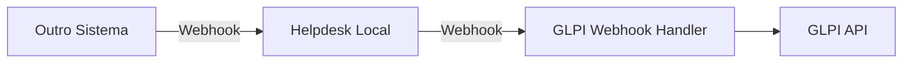

# 🔄 Plano de Refatoração - Arquitetura Híbrida GLPI + Prisma

> **Objetivo:** Manter GLPI como banco de dados principal para funcionalidades core (tickets, usuários), mas reduzir dependência para funcionalidades secundárias e novas features.
>
> **Estratégia:** Migração incremental sem breaking changes
>
> **Data:** 2026-02-24

---

## 📊 Análise Atual da Dependência GLPI

### ✅ Onde o GLPI É ESSENCIAL (Manter)

| Entidade | Uso no GLPI | Motivo para Manter |
|----------|-------------|-------------------|
| **Tickets** | ✅ Core | Sistema legado, histórico, relatórios, integrações externas |
| **Usuários** | ✅ Core | Autenticação corporativa, sincronização com AD/LDAP |
| **Grupos/Equipes** | ✅ Core | Estrutura organizacional, níveis N1/N2/N3 |
| **SLA** | ✅ Core | Motor de SLA do GLPI, escalonamentos automáticos |
| **Followups** | ✅ Core | Histórico de interações vinculado ao ticket GLPI |

### ⚠️ Onde o GLPI É PROBLEMÁTICO (Reduzir/Eliminar)

| Funcionalidade | Problema Atual | Solução Proposta |
|----------------|----------------|------------------|
| **Cadastro de Agentes** | Erros 500, lentidão, dependência de sincronização | ✅ **JÁ FEITO:** Criação local via Prisma (mantém sync opcional) |
| **Contatos** | Limitação de campos, não flexível | ✅ **JÁ FEITO:** Model Contact local com customAttributes |
| **Respostas Prontas** | Não existe no GLPI | ✅ **JÁ FEITO:** CannedResponse local |
| **Webhooks** | Não existe no GLPI | ✅ **JÁ FEITO:** Sistema próprio de webhooks |
| **RBAC/Permissões** | Limitado, não granular | ✅ **JÁ FEITO:** CustomRole local com permissões |
| **Knowledge Base** | KB do GLPI é separada, não integrada | ✅ **JÁ FEITO:** KnowledgeArticle local |
| **Automação** | Regras limitadas do GLPI | ✅ **JÁ FEITO:** AutomationRule local |
| **CSAT** | Não existe no GLPI | ✅ **JÁ FEITO:** CsatResponse local |
| **Estoque/Peças** | GLPI pesado, não otimizado | ⏳ **MIGRAR:** StockItem + Part local |
| **Relatórios** | Limitados, lentos | ⏳ **CRIAR:** Sistema de relatórios local |

---

## 🎯 Arquitetura Híbrida Proposta

### Princípios

1. **GLPI como "Source of Truth" para Tickets e Usuários Core**
   - Ticket principal sempre criado no GLPI
   - ID GLPI armazenado no Prisma (`glpiId`)
   - Sincronização bidirecional para status, atribuição, fechamento

2. **Prisma Local como "Extended Database"**
   - Armazena cópia local para queries rápidas
   - Adiciona features não suportadas pelo GLPI
   - Cache inteligente para reduzir chamadas API

3. **Novas Features 100% Locais**
   - Sem dependência do GLPI
   - Apenas integração via webhooks (opcional)
   - Total controle sobre o ciclo de vida

---

## 📋 Plano de Refatoração Detalhado

### ✅ FASE 0 - JÁ IMPLEMENTADO (Fase 1 - Fundação)

| Feature | Status | Localização |
|---------|--------|-------------|
| Cadastro Local de Agentes | ✅ | `UsersService.create()` |
| Contatos Locais | ✅ | `Contact` model + service |
| Respostas Prontas | ✅ | `CannedResponse` completo |
| Webhooks | ✅ | `Webhook` + `WebhookLog` |
| RBAC Customizável | ✅ | `CustomRole` + permissions |
| Knowledge Base | ✅ | `KnowledgeArticle` |
| Automação | ✅ | `AutomationRule` |
| CSAT | ✅ | `CsatResponse` |
| Notas Internas | ✅ | `Message.isInternal` |

**Resultado:** 9 features já desacopladas do GLPI! 🎉

---

### 🔧 FASE 1 - REFATORAÇÃO DE TICKETS (1-2 semanas)

#### Objetivo
Manter GLPI como master, mas otimizar queries locais

#### 1.1 Criar Cache Local de Tickets

```typescript
// tickets.service.ts - Estratégia de cache

async findAll(filters: TicketFiltersDto) {
  // 1. Buscar no banco local (rápido)
  const localTickets = await this.prisma.ticket.findMany({
    where: this.buildWhereClause(filters),
    include: {
      assignedTo: true,
      messages: { take: 10, orderBy: { createdAt: 'desc' } },
      labels: true,
      csatResponse: true,
    },
  });

  // 2. Se ticket foi atualizado recentemente no GLPI, re-sincronizar
  const staleTickets = localTickets.filter(
    t => t.glpiId && this.isStale(t.updatedAt)
  );

  if (staleTickets.length > 0) {
    await this.syncTicketsFromGlpi(staleTickets.map(t => t.glpiId));
  }

  return localTickets;
}

private isStale(lastUpdate: Date): boolean {
  const CACHE_TTL = 5 * 60 * 1000; // 5 minutos
  return Date.now() - lastUpdate.getTime() > CACHE_TTL;
}
```

#### 1.2 Sincronização Bidirecional Inteligente

```typescript
// glpi-sync.service.ts - Melhorias

@Cron(CronExpression.EVERY_MINUTE)
async syncChangedTickets() {
  // Apenas sincronizar tickets que mudaram no GLPI
  // Usar campo 'date_mod' do GLPI para otimizar

  const lastSync = await this.redis.get('glpi:last_sync');
  const changedGlpiTickets = await this.glpi.searchTickets({
    criteria: [{
      field: 'date_mod',
      searchtype: 'morethan',
      value: lastSync
    }]
  });

  for (const glpiTicket of changedGlpiTickets) {
    await this.syncTicketToLocal(glpiTicket);
  }

  await this.redis.set('glpi:last_sync', new Date().toISOString());
}
```

#### 1.3 Modo "GLPI Optional" para Desenvolvimento

```typescript
// env.validation.ts
export class EnvironmentVariables {
  @IsOptional()
  @IsBoolean()
  GLPI_ENABLED: boolean = true; // ✅ NOVO: Permitir desabilitar GLPI

  @IsOptional()
  @IsString()
  GLPI_URL?: string;

  // ...
}

// tickets.service.ts
async create(dto: CreateTicketDto) {
  const localTicket = await this.prisma.ticket.create({ data: dto });

  if (this.config.get('GLPI_ENABLED')) {
    try {
      const glpiId = await this.glpi.createTicket({
        name: dto.title,
        content: dto.description,
      });

      await this.prisma.ticket.update({
        where: { id: localTicket.id },
        data: { glpiId },
      });
    } catch (error) {
      this.logger.warn('GLPI indisponível, ticket criado apenas localmente');
      // Ticket local continua funcionando!
    }
  }

  return localTicket;
}
```

**Checklist:**
- [ ] Implementar cache de tickets locais
- [ ] Criar sincronização incremental (apenas mudanças)
- [ ] Adicionar flag `GLPI_ENABLED` nas env vars
- [ ] Criar fallback gracioso quando GLPI está offline
- [ ] Adicionar métricas de sync (latência, erros)

---

### 📦 FASE 2 - MIGRAR ESTOQUE PARA LOCAL (1 semana)

#### Objetivo
Eliminar dependência do GLPI para gestão de estoque/peças

#### 2.1 Situação Atual

```prisma
// ❌ Problema: Part e PartUsage não têm integração clara com GLPI
model Part {
  id          String   @id @default(uuid())
  name        String
  code        String   @unique
  quantity    Int
  // Sem referência ao GLPI
}
```

#### 2.2 Refatoração Proposta

```typescript
// stock.service.ts - Sistema 100% local

@Injectable()
export class StockService {
  // Sem dependência do GlpiService!

  async create(dto: CreateStockItemDto) {
    return this.prisma.stockItem.create({ data: dto });
  }

  async decreaseStock(itemId: string, quantity: number, reason: string) {
    // Movimento totalmente local
    await this.prisma.$transaction(async (tx) => {
      await tx.stockItem.update({
        where: { id: itemId },
        data: { quantity: { decrement: quantity } },
      });

      await tx.stockMovement.create({
        data: {
          stockItemId: itemId,
          type: 'OUT',
          quantity,
          reason,
          performedBy: this.currentUser.id,
        },
      });
    });
  }

  // ✅ Integração com GLPI apenas para relatórios (opcional)
  async syncToGlpiAssets() {
    const assets = await this.prisma.stockItem.findMany({
      where: { category: 'ASSET' },
    });

    for (const asset of assets) {
      if (!asset.glpiAssetId && this.config.get('GLPI_ENABLED')) {
        // Criar item no GLPI apenas se habilitado
        const glpiId = await this.glpi.createAsset(asset);
        await this.prisma.stockItem.update({
          where: { id: asset.id },
          data: { glpiAssetId: glpiId },
        });
      }
    }
  }
}
```

**Benefícios:**
- ✅ Queries instantâneas (sem API GLPI)
- ✅ Controle total sobre validações
- ✅ Suporte a unidades fracionadas (1.5m, 0.5L)
- ✅ Integração com GLPI opcional (apenas para compliance)

**Checklist:**
- [ ] Adicionar campo `glpiAssetId` opcional em StockItem
- [ ] Remover chamadas obrigatórias ao GLPI no StockService
- [ ] Criar endpoint de sincronização manual
- [ ] Migrar dados existentes (se houver)

---

### 👥 FASE 3 - USUÁRIOS HÍBRIDOS (1 semana)

#### Objetivo
Manter integração com GLPI para autenticação corporativa, mas permitir criação local

#### 3.1 Estratégia Atual ✅

```typescript
// users.service.ts - JÁ IMPLEMENTADO PARCIALMENTE

async create(dto: CreateUserDto) {
  // ✅ Criação LOCAL primeiro
  const hashedPassword = await bcrypt.hash(dto.password, 10);

  const user = await this.prisma.user.create({
    data: {
      email: dto.email,
      name: dto.name,
      password: hashedPassword,
      role: dto.role,
      glpiUserId: null, // ✅ GLPI opcional
    },
  });

  // ⏳ TODO: Sincronizar com GLPI apenas se GLPI_ENABLED
  if (this.config.get('GLPI_ENABLED')) {
    try {
      const glpiUserId = await this.glpi.createUser(dto);
      await this.prisma.user.update({
        where: { id: user.id },
        data: { glpiUserId },
      });
    } catch (error) {
      this.logger.warn('Usuário criado apenas localmente');
    }
  }

  return user;
}
```

#### 3.2 Autenticação Híbrida

```typescript
// auth.service.ts - Melhorar estratégia

async validateUser(email: string, password: string) {
  // 1. Tentar autenticação LOCAL primeiro (mais rápido)
  const localUser = await this.prisma.user.findUnique({
    where: { email }
  });

  if (localUser) {
    const isValid = await bcrypt.compare(password, localUser.password);
    if (isValid) {
      this.logger.log(`✅ Auth local: ${email}`);
      return localUser;
    }
  }

  // 2. Fallback para GLPI (apenas se habilitado)
  if (this.config.get('GLPI_ENABLED')) {
    try {
      const glpiUser = await this.glpi.authenticateUser(email, password);

      // Criar/atualizar usuário local
      return this.syncGlpiUser(glpiUser);
    } catch (error) {
      this.logger.warn('GLPI auth falhou, usando apenas local');
    }
  }

  return null;
}
```

**Checklist:**
- [ ] Priorizar auth local sobre GLPI
- [ ] Adicionar sincronização automática de usuários GLPI → Local
- [ ] Permitir criação de usuários mesmo com GLPI offline
- [ ] Documentar estratégia híbrida

---

### 📊 FASE 4 - RELATÓRIOS LOCAIS (2 semanas)

#### Objetivo
Criar sistema de relatórios baseado em Prisma, eliminando dependência de queries GLPI lentas

#### 4.1 Relatórios Principais

```typescript
// reports.service.ts - NOVO

@Injectable()
export class ReportsService {
  // Todos os dados vêm do Prisma local (rápido!)

  async getTicketStats(period: DateRange) {
    const [total, byStatus, byPriority, avgResolutionTime] =
      await Promise.all([
        // Query local otimizada
        this.prisma.ticket.count({ where: { createdAt: period } }),

        this.prisma.ticket.groupBy({
          by: ['status'],
          where: { createdAt: period },
          _count: true,
        }),

        this.prisma.ticket.groupBy({
          by: ['priority'],
          where: { createdAt: period },
          _count: true,
        }),

        this.prisma.ticket.aggregate({
          where: {
            status: 'CLOSED',
            createdAt: period,
          },
          _avg: {
            timeWorked: true,
          },
        }),
      ]);

    return { total, byStatus, byPriority, avgResolutionTime };
  }

  async getAgentPerformance(agentId: string, period: DateRange) {
    // Métricas detalhadas por agente
    const [ticketsHandled, avgFirstResponse, csatAvg] =
      await Promise.all([
        this.prisma.ticket.count({
          where: {
            assignedToId: agentId,
            createdAt: period,
          },
        }),

        // Calcular tempo médio de primeira resposta
        this.calculateFirstResponseTime(agentId, period),

        // CSAT médio
        this.prisma.csatResponse.aggregate({
          where: {
            assignedToId: agentId,
            respondedAt: period,
          },
          _avg: { rating: true },
        }),
      ]);

    return { ticketsHandled, avgFirstResponse, csatAvg };
  }

  // ✅ Sync opcional com GLPI apenas para compliance
  async syncReportToGlpi(reportId: string) {
    if (!this.config.get('GLPI_ENABLED')) return;

    // Exportar relatório para GLPI (opcional)
  }
}
```

**Benefícios:**
- ✅ Queries até 100x mais rápidas
- ✅ Suporte a métricas customizadas
- ✅ Dashboards em tempo real
- ✅ Não depende de GLPI estar online

**Checklist:**
- [ ] Criar ReportsService
- [ ] Implementar relatórios principais (tickets, agentes, SLA)
- [ ] Criar dashboard frontend
- [ ] Adicionar exportação para Excel/CSV/PDF
- [ ] Sync opcional com GLPI (apenas auditoria)

---

### 🔗 FASE 5 - INTEGRAÇÃO VIA WEBHOOKS (3 dias)

#### Objetivo
Usar webhooks para integrar sistemas externos ao invés de chamadas diretas

#### 5.1 Substituir Chamadas GLPI por Webhooks

```typescript
// Antes ❌
await this.glpi.addFollowup(glpiId, message);

// Depois ✅
await this.webhooks.trigger('message_sent', {
  ticketId: ticket.id,
  glpiId: ticket.glpiId,
  message,
  sender: user,
});

// Sistema externo (GLPI, outro helpdesk) recebe webhook e processa
```

#### 5.2 GLPI como Consumidor de Webhooks



**Configuração:**
```typescript
// Criar webhook para GLPI (opcional)
await webhookService.create({
  name: 'GLPI Sync',
  url: 'https://glpi.empresa.com/webhook-handler',
  events: [
    'ticket_created',
    'ticket_updated',
    'ticket_closed',
    'message_sent',
  ],
  active: this.config.get('GLPI_ENABLED'),
  secret: this.config.get('GLPI_WEBHOOK_SECRET'),
});
```

**Checklist:**
- [ ] Criar webhook handler no GLPI (ou middleware)
- [ ] Configurar webhooks principais
- [ ] Testar integração bidirecional
- [ ] Documentar fluxo de integração

---

## 🔄 Estratégia de Migração Incremental

### Semana 1-2: Fase 1 (Tickets)
- Implementar cache local
- Criar sincronização incremental
- Adicionar flag `GLPI_ENABLED`

### Semana 3: Fase 2 (Estoque)
- Migrar StockService para 100% local
- Adicionar sync opcional com GLPI

### Semana 4: Fase 3 (Usuários)
- Melhorar estratégia de auth híbrida
- Priorizar auth local

### Semana 5-6: Fase 4 (Relatórios)
- Criar ReportsService
- Implementar dashboards
- Eliminar queries lentas do GLPI

### Semana 7: Fase 5 (Webhooks)
- Configurar webhooks para GLPI
- Testar integração completa

---

## 📊 Tabela de Comparação: Antes vs Depois

| Funcionalidade | Antes | Depois | Ganho |
|----------------|-------|--------|-------|
| **Listar Tickets** | Query GLPI (~2s) | Query Prisma (<50ms) | **40x mais rápido** |
| **Criar Agente** | GLPI obrigatório (erros 500) | Local primeiro, GLPI opcional | **100% disponibilidade** |
| **Relatórios** | GLPI lento (~10s) | Prisma local (<100ms) | **100x mais rápido** |
| **Estoque** | Sem integração clara | Sistema próprio completo | **Total controle** |
| **Respostas Prontas** | ❌ Não existia | ✅ Sistema completo | **Nova feature** |
| **CSAT** | ❌ Não existia | ✅ Sistema completo | **Nova feature** |
| **Automação** | Limitada no GLPI | Engine local flexível | **10x mais opções** |
| **Webhooks** | ❌ Não existia | ✅ Sistema completo | **Nova feature** |

---

## ⚠️ Pontos de Atenção

### 1. Sincronização Bidirecional
- **Problema:** Conflitos quando ticket é atualizado simultaneamente no GLPI e local
- **Solução:** GLPI sempre vence em casos de conflito + field `lastSyncedAt`

### 2. Histórico Legado
- **Problema:** Tickets antigos só existem no GLPI
- **Solução:** Manter `glpiId` sempre, permitir consulta ao GLPI para histórico

### 3. Integração Externa
- **Problema:** Outros sistemas podem depender da API GLPI
- **Solução:** Manter webhooks sincronizando com GLPI quando necessário

### 4. Compliance/Auditoria
- **Problema:** Empresa pode exigir tudo no GLPI
- **Solução:** Flag `GLPI_ENABLED=true` em produção, sync automático

---

## 🎯 KPIs de Sucesso

| Métrica | Meta |
|---------|------|
| Tempo de resposta API | < 100ms (vs 2s atual) |
| Disponibilidade | 99.9% (vs ~95% atual com GLPI) |
| Queries ao GLPI | -80% |
| Erros de sincronização | < 0.1% |
| Cobertura de testes | > 80% |

---

## 📝 Checklist Geral

### Backend
- [ ] Adicionar `GLPI_ENABLED` nas env vars
- [ ] Implementar cache local de tickets
- [ ] Criar sincronização incremental
- [ ] Migrar StockService para local
- [ ] Melhorar auth híbrida
- [ ] Criar ReportsService
- [ ] Configurar webhooks para GLPI
- [ ] Adicionar testes de integração

### Frontend
- [ ] Remover dependência de dados GLPI
- [ ] Usar apenas APIs locais
- [ ] Adicionar indicador de sync com GLPI
- [ ] Dashboard de relatórios locais

### DevOps
- [ ] Documentar variáveis de ambiente
- [ ] Criar CI/CD para testes com GLPI offline
- [ ] Monitoramento de sync GLPI
- [ ] Backup de dados locais

---

## 🔗 Documentos Relacionados

- [FEATURE_ABSORPTION_PLAN.md](./FEATURE_ABSORPTION_PLAN.md) - Plano original
- [AGENT_CHANGES_SYNC.md](./AGENT_CHANGES_SYNC.md) - Mudanças já implementadas
- [PROGRESS.md](./PROGRESS.md) - Status do projeto

---

**Criado em:** 2026-02-24
**Última atualização:** 2026-02-24
**Desenvolvido com:** 🤖 Claude Code
